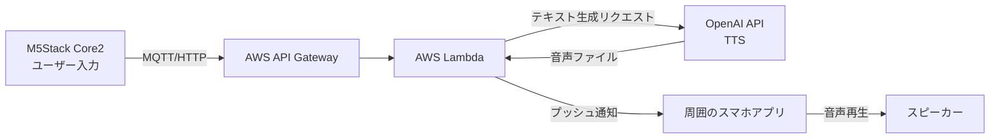

# Sub Voice: 意思表示を支援するIoTウェアラブルデバイス


-orange)


## 🚀 セットアップ (Setup)

このプロジェクトをクローンした後は、以下の設定を行ってください。

### 1. ファームウェア設定 (Firmware)
`fireware/DeviceA_Main.ino` を開き、以下の変数をあなたの環境に合わせて変更してください。

```cpp
const char* SSID     = "YOUR_SSID";       // Wi-FiのSSID
const char* PASSWORD = "YOUR_WIFI_PASS";  // Wi-Fiのパスワード
const char* AUDIO_API_URL = "YOUR_API";   // API GatewayのURL
```

### 2. フロントエンド設定 (Frontend)
`frontend/index.html` を開き、APIのエンドポイントを設定してください。

```javascript
const apiBase = "YOUR_API_GATEWAY_URL"; // API GatewayのURL
const NIF_API = "YOUR_LAMBDA_URL";      // Lambda関数のURL
```

### 3. バックエンド設定 (Backend)
AWS Lambdaの環境変数として以下を設定してください。
- `OPENAI_API_KEY`: OpenAIのAPIキー
- `BUCKET_NAME`: 音声保存用のS3バケット名
- `MQTT_SERVER`: MQTTブローカーのアドレス
- `MQTT_TOPIC`: MQTTトピック

## 📖 概要 (Overview)

**Sub Voice** は、発話困難者や車椅子ユーザーが、駅のホームや人混みなどの騒音環境下でスムーズに意思表示を行うためのIoTデバイスです。

**M5Stack (ハードウェア)**、**AWS (クラウド)**、**OpenAI (生成AI)** を統合することで、ボタン一つで周囲のスマートフォンに通知を送り、「気づいてもらえない」という課題を解決します。

## 🎥 デモ (Demo)

[**▶️ デモ動画を見る (Google Drive)**](https://drive.google.com/file/d/10Vc6KlZS4SRGajUtY2HGl7x_mLTRRWNd/view?usp=drive_link)

> **Note**: 動画ファイルサイズが大きいため、外部ホスティングを使用しています。

## 🏗 システム構成 (Architecture)

物理デバイス(M5Stack)からの入力をAWSクラウドで処理し、生成AIによる音声合成を経て、周囲のスマホへリアルタイムに通知する構成です。



### 🔧 技術スタック

| Category | Tech Stack |
| --- | --- |
| **Hardware** | M5Stack Core2 (C++, ESP32) |
| **Cloud Infrastructure** | AWS Lambda, API Gateway, S3 |
| **AI Services** | OpenAI API (Text-to-Speech) |
| **Frontend** | Android / Web App (概念実証のためAI支援ツールを活用して開発) |

## 💡 こだわりのポイント

1.  **ワンタッチでの意思表示**
    * 咄嗟の場面でも使えるよう、「通ります」「降ります」などの定型文を物理ボタンで即座に送信可能です。

2.  **生成AIによる「配慮ある」音声**
    * 単なるロボット音声ではなく、公共の場に適した「申し訳なさ」や「丁寧さ」を含んだ自然な発話をOpenAI APIで生成しています。

3.  **クラウドネイティブな拡張性**
    * サーバーレス構成（AWS Lambda）を採用し、デバイス数が増えても柔軟に対応できるアーキテクチャを設計しました。

## 👨‍💻 担当領域 (My Contribution)

**Role: Lead Engineer**
5名のチーム開発において、システム全体の設計と実装を担当しました。

* **ファームウェア開発**
    * M5Stack (C++) のタッチパネル制御およびWi-Fi通信処理を実装。
* **クラウドバックエンド構築**
    * AWS上でのサーバーレスアーキテクチャの設計・構築、OpenAI APIとの連携処理を担当。
* **プロトタイピング (AI活用)**
    * フロントエンド（スマホアプリ）部分は、AIコーディングツールを活用してプロトタイプを高速に作成しました。
    * これにより、アプリ実装の工数を最小限に抑え、ハードウェア連携とUX検証（ユーザー体験の向上）に時間を割くことができました。

## 🔮 今後の課題 (Future Work)

現在はプロトタイプ段階のため、実運用に向けて以下の課題を認識しています。

- [ ] **音声の大きさを改善**: 現在は音が小さく混雑した環境下では聞こえづらいという課題があります。そのため、小型でありながらも大きな音声が出せるようYAMAHAのスピーカーか震動版を活用した解決策を試す。
- [ ] **省電力化**: M5StackのDeep Sleepモードを最適化し、一日中持ち歩けるバッテリー寿命を実現する。
- [ ] **エッジAI化**: 通信遅延とコストを削減するため、音声生成処理の一部をデバイス側（エッジ）へ移行することを検討中。

---

Created by **[Kohta Azegami]**